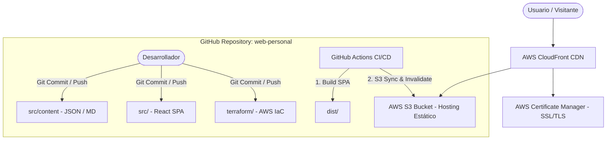

# 01. Visión General de Arquitectura (Architecture Overview)

## 📌 Contexto del Proyecto
Este proyecto es una plataforma web personal desarrollada paso a paso con arquitectura modular y desacoplada. Su propósito es presentar experiencia profesional, diseños en Figma, el proyecto **Colabb**, artículos técnicos escritos por el autor y enlaces relevantes.

---

## 🏗️ Diagrama de Arquitectura

---

## ⚙️ Componentes Principales

### 1. Frontend (Next.js App Router)
* **Framework:** Next.js (TypeScript, React 19 / App Router) con salida estática (`output: 'export'`).
* **Estilos:** Tailwind CSS + Tokens de diseño personalizados.
* **Manejo de Contenido:** Carga local/dinámica de esquemas JSON y archivos Markdown desde `src/content/`.
* **Build Target:** Genera la carpeta `out/` con archivos HTML/CSS/JS optimizados para S3.

### 2. Infraestructura (Terraform + AWS)
* **Storage:** Bucket S3 configurado como sitio estático restringido.
* **CDN:** CloudFront OAC (Origin Access Control) para servir el bucket de manera segura con cache global.
* **Seguridad:** HTTPS mediante AWS Certificate Manager (ACM).

### 3. CI/CD (GitHub Actions)
* Automatizaciones para construir la app (`npm run build`), sincronizar el resultado estático al Bucket S3 y purgar la caché de CloudFront automáticamente al subir cambios a `main`.

---

## 📝 Decisiones de Diseño Registradas (ADRs)
* **ADR-001 (Estrategia de Contenido):** Se elige un enfoque de archivos estáticos (Git-based) en lugar de una base de datos externa para garantizar costo cero en almacenamiento de backend, máxima velocidad y alta seguridad.
